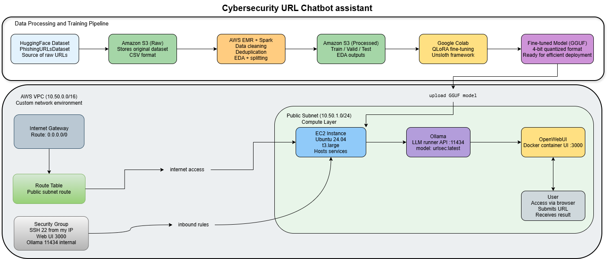

# Cloud-Based Malicious URL Detection Assistant

**CISC 886 – Cloud Computing**  
**Queen’s University – School of Computing**  
**Group:** CISC886-27

| Student Name | Student ID |
|---|---:|
| Mohamed Youssef | 20596366 |
| Mahmoud Abdel Aleem | 20596359 |
| Mohanad Ghoraba | 20596354 |

---

## Abstract

This repository contains the implementation files for an end-to-end cloud-based malicious URL detection assistant. The system uses AWS services for data storage, distributed preprocessing, and model deployment. A phishing URL dataset is preprocessed using Apache Spark on AWS EMR, then a lightweight instruction-tuned LLM is fine-tuned using QLoRA/PEFT in Google Colab. The final model is exported in GGUF format, deployed on an AWS EC2 instance using Ollama, and accessed through OpenWebUI.

---

## 1. System Architecture



**Figure 1.** End-to-end system architecture showing dataset ingestion, S3 storage, EMR preprocessing, QLoRA fine-tuning, EC2 deployment, Ollama serving, and OpenWebUI user interaction.

The system starts by storing the phishing URL dataset in Amazon S3. AWS EMR runs a PySpark preprocessing pipeline to clean the data, remove duplicate URLs, generate exploratory outputs, and create train/validation/test splits. The processed data is then used in Google Colab to fine-tune Llama-3.2-1B-Instruct using QLoRA. After training, the model is exported as a GGUF artifact and deployed on an AWS EC2 instance. Ollama serves the model locally, while OpenWebUI provides the browser-based chat interface.

---

## 2. Repository Structure

```text
.
├── README.md
├── spark/
│   └── spark_preprocessing.py
├── notebooks/
│   └── fine_tuning_url_assistant.ipynb
├── models/
│   └── model artifact / GGUF files
└── images/
    └── system_architecture.png
```

---

## 3. Prerequisites

The following tools and accounts are required to reproduce the project:

| Requirement | Purpose |
|---|---|
| AWS account | S3, EMR, EC2, VPC, security groups |
| AWS CLI | Uploading data and managing AWS resources |
| Python 3.10+ | Local scripts and preprocessing support |
| Google Colab | QLoRA/PEFT fine-tuning |
| Git | Repository management |
| Docker | Running OpenWebUI |
| SSH key pair | Accessing the EC2 instance |

---

## 4. Dataset and Model

| Item | Description |
|---|---|
| Dataset | Phishing URLs Dataset |
| Dataset source | `semihGuner2002/PhishingURLsDataset` on Hugging Face |
| Dataset license | Apache License 2.0 |
| Base model | Llama-3.2-1B-Instruct 4-bit |
| Model source | Unsloth / Hugging Face |
| Fine-tuning method | QLoRA / PEFT |
| Deployment format | GGUF |
| LLM runner | Ollama |
| Web interface | OpenWebUI |

---

## 5. AWS Infrastructure Summary

| Component | Configuration |
|---|---|
| Region | `us-east-1` |
| VPC CIDR | `10.50.0.0/16` |
| Public subnet | `10.50.1.0/24` |
| Internet gateway | Attached to custom VPC |
| Route table | `0.0.0.0/0` routed to Internet Gateway |
| Security group | SSH 22, OpenWebUI 3000, Ollama 11434 restricted |
| EMR cluster | 1 master node + 2 core nodes |
| EMR instance type | `m5.xlarge` |
| EC2 instance | `t3.large` |
| AMI | Ubuntu 24.04 LTS |

---

## 6. Reproduction Steps

### 6.1 Upload Dataset to S3

```bash
aws s3 cp phishing_urls_dataset.csv s3://20596366-cisc886-url-assistant-v2/raw/
```

### 6.2 Upload Spark Script to S3

```bash
aws s3 cp spark/spark_preprocessing.py s3://20596366-cisc886-url-assistant-v2/spark/spark_preprocessing.py
```

### 6.3 Run PySpark Preprocessing on EMR

Submit the Spark job on the EMR cluster:

```bash
spark-submit s3://20596366-cisc886-url-assistant-v2/spark/spark_preprocessing.py
```

The preprocessing step performs:

- removal of missing URL and label values;
- label conversion to integer format;
- URL length feature extraction;
- duplicate URL removal;
- train/validation/test splitting;
- saving processed outputs and EDA files to S3.

Expected S3 output structure:

```text
s3://20596366-cisc886-url-assistant-v2/processed/
├── train/
├── validation/
├── test/
└── eda/
```

---

## 7. Model Fine-Tuning

Open the following notebook in Google Colab:

```text
notebooks/fine_tuning_url_assistant.ipynb
```

The notebook fine-tunes the selected Llama-3.2-1B-Instruct model using QLoRA/PEFT.

### Hyperparameter Summary

| Item | Value |
|---|---|
| Base model | Llama-3.2-1B-Instruct 4-bit |
| Fine-tuning method | QLoRA / PEFT |
| LoRA rank | 16 |
| LoRA alpha | 16 |
| Max sequence length | 512 |
| Batch size | 2 |
| Gradient accumulation steps | 4 |
| Effective batch size | 8 |
| Learning rate | 2e-4 |
| Max training steps | 250 |
| Optimizer | AdamW 8-bit |
| Output format | Classification, risk level, and reason |

---

## 8. EC2 Deployment with Ollama

Connect to the EC2 instance:

```bash
ssh -i ~/.ssh/cisc886-key ubuntu@<EC2_PUBLIC_IP>
```

Install Ollama:

```bash
curl -fsSL https://ollama.com/install.sh | sh
sudo systemctl enable ollama
sudo systemctl restart ollama
```

Upload the GGUF model archive:

```bash
scp -i ~/.ssh/cisc886-key real-gguf-only.zip ubuntu@<EC2_PUBLIC_IP>:~
```

Unzip the model files:

```bash
unzip -o real-gguf-only.zip
```

Create the Ollama `Modelfile`:

```bash
cat > Modelfile <<'EOF'
FROM /home/ubuntu/url-cybersecurity-gguf_gguf/Llama-3.2-1B-Instruct.Q4_K_M.gguf

SYSTEM """
You are a cybersecurity URL analysis assistant.
Classify URLs as safe/benign or phishing/malicious.
Always answer using this exact format:
Classification:
Risk level:
Reason:
"""
EOF
```

Register the model:

```bash
ollama create urlsec -f Modelfile
```

Check that the model is available:

```bash
ollama list
```

Run the model:

```bash
ollama run urlsec
```

Test the local API:

```bash
curl http://localhost:11434/api/generate -d '{
  "model": "urlsec",
  "prompt": "Classify this URL: http://paypal-login-verification-security.com/update/account. Return exactly: Classification: Risk level: Reason:",
  "stream": false
}'
```

---

## 9. Web Interface with OpenWebUI

Run OpenWebUI using Docker:

```bash
docker run -d \
 --name open-webui \
 --restart always \
 -p 3000:8080 \
 --add-host=host.docker.internal:host-gateway \
 -e OLLAMA_BASE_URL=http://host.docker.internal:11434 \
 -v open-webui:/app/backend/data \
 ghcr.io/open-webui/open-webui:main
```

Access the interface from a browser:

```text
http://<EC2_PUBLIC_IP>:3000
```

---

## 10. Example Inference

### Input

```text
http://paypal-login-verification-security.com/update/account
```

### Expected Output

```text
Classification: phishing/malicious
Risk level: high
Reason: The URL contains suspicious phishing-like patterns and imitates a login verification page.
```

---

## 11. Cost Summary

The project was executed using a personal AWS account under Free Tier conditions. The AWS dashboard showed no charged balance for the billing period, while AWS Cost Explorer showed approximate usage value.

| Cost Type | Value |
|---|---:|
| Actual charged cost | $0.00 |
| Estimated usage cost | $7.74 |

### Estimated Cost Breakdown

| Service | Usage Description | Approximate Cost |
|---|---|---:|
| Amazon EC2 | EC2 instance used for deployment | ~$5.00 |
| Amazon EMR | Spark preprocessing cluster | ~$2.50 |
| Amazon S3 | Dataset storage and requests | ~$0.24 |
| **Total** |  | **~$7.74** |

---

## 12. Notes on Security

SSH access was restricted to the project user's IP address. The OpenWebUI port was also limited for demonstration access. Ollama's API port was treated as an internal service and was not intended to be exposed publicly.

---

## 13. License

- Dataset License: Apache License 2.0  
- Model License: Llama 3 Community License  
- Project code: For academic use in CISC 886 Cloud Computing

---

## 14. Acknowledgement

This project was completed as part of CISC 886 Cloud Computing at Queen's University.
